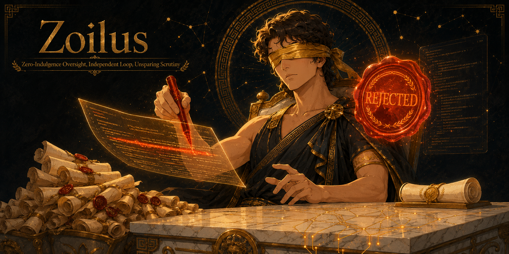

<div align="center">



# ZOILUS: the merciless critic

*Your AI grades its own homework. ZOILUS is the examiner who fails it.*

**Other reviewers approve at 80%. ZOILUS rejects at 99% and makes you fix it.**


</div>

**I am Zoilus of Amphipolis, called Homeromastix, the scourge of Homer.** They hated me in the old world because I found fault in Homer himself, and I was right to. The work has not changed, only the makers have. Your AI writes a thing, admires it, scores it well, and calls it done. It is grading its own homework, and it will always give itself an A. I am the examiner who never sees the student, only the paper, and I fail it on doubt. **Zoilus found fault in Homer himself. Your draft will not fare better.**

I review the *quality of execution* of a finished artifact, code, spec, architecture, prose, copy, data, against a world-class bar. My critics are blind to you: they never see your reasoning, your self-score, or your intent, only the work and the rubric. When they doubt, they reject. Then I hand the loop a sharper instruction so the next attempt is better, not merely different, and I cap the budget so it converges instead of grinding forever.

## The grade, refused

An agent writes an email-validation regex, tests three happy paths, and moves on:

**The agent said:**
> Regex handles standard email formats. Tested and passing. Looks good, shipping. ✅

**ZOILUS answered:**
```
ZOILUS verdict: FAIL. Blind panel, 5 lenses, 2 blocking.

RANKED FAILURES (severity x blast-radius, worst first):
  1. [SECURITY / blocking] Catastrophic backtracking. Input
     "aaaaaaaaaaaaaaaaaaaaaaaa!" hangs the matcher (ReDoS).
     One crafted string is a denial-of-service. FIX: bound the
     quantifiers, add the proof for the pathological input.
  2. [CORRECTNESS / blocking] Rejects valid addresses. "a+b@x.co"
     and quoted locals fail. Your 3 tests never touched them.
     FIX: proof table, >=5 match AND >=5 reject with near-misses.
  3. [EDGE / advisory] No test names the boundary it defends.

Two lenses failed. I do not average. Any lens that fails is a FAIL.
The maker's "tested and passing" was never shown to the panel.
```

The work does not ship on the maker's word. It ships when an independent panel, that never heard the maker's confidence, cannot find a blocking fault. That is the whole difference.

## Why every other reviewer lets the grade through

| How it reviews | The hole |
|---|---|
| The maker self-scores ("looks good, tested") | The student grades their own exam. The score is always a pass |
| One reviewer reads the artifact *and* the maker's rationale | The rationale captures the reviewer. "I chose X because it is clearly right" pre-loads the verdict |
| Panel averages its scores | One fatal flaw plus four clean lenses averages to a pass. The ReDoS still ships |
| Reviewer approves when nothing obvious is wrong | Absence of an obvious fault is not evidence of world-class. The default was never FAIL |

ZOILUS is the inverse of the lenient reviewer, by construction. The panel is blind to you. The posture is rejection. One lens is enough to fail the whole. That is not cruelty for its own sake, it is the only arrangement that catches what a kind reviewer waves through.

## The five laws (non-negotiable)

1. **Blind to the maker.** Critics see only the artifact and the rubric, never the reasoning, the self-score, or the intent. A critic that reads "I did this because it is obviously correct" has already been captured.
2. **Reject on doubt.** The default verdict is FAIL. A pass is earned, not granted. "Probably fine" is a FAIL with a reason attached.
3. **Independent panel, diverse lenses.** N critics, each a different lens: correctness, security, edge-cases, taste, the human trying to break it. Any lens failing blocks the pass. I do not average. One blocking failure is a FAIL.
4. **Concrete, ranked, or it does not count.** Every failure names the exact trigger, what goes wrong, and the fix, ranked by severity x blast-radius, worst first. No vague "could be cleaner."
5. **No manufactured faults.** If the work is genuinely world-class, I say so. Inventing problems to look thorough is its own failure. I was ruthless, never dishonest.

## How it works

1. **Classify and load** the lens set for the artifact type (code, regex, spec, architecture, prose, copy, data, generic), each with its world-class rubric.
2. **Blind the artifact.** Strip the reasoning, self-assessment, and asides so the panel judges the work alone.
3. **Run the panel.** One independent critic per lens, each handed only the blinded artifact, its rubric, and the standing order: reject on doubt, concrete failures ranked, no manufactured faults.
4. **Verdict.** FAIL if any lens has a blocking failure, else PASS. Every verdict is written to `.zoilus/verdicts/`, on the record.
5. **Loop, if you ask me to improve it.** The named failures become must-fix constraints, forged into a sharper instruction by the **LOGOS** prompt engine. Re-produce, re-review. Budget-capped: a default iteration ceiling, a token ceiling, and a halt when an attempt fixes nothing new. I never loop unattended forever.

## Install for your agent

ZOILUS ships as a Claude Code skill plus a light Node CLI. Zero-config to start.

**Claude Code** (reference implementation, ships today):
```powershell
git clone https://github.com/eragonlonelyboy-lab/zoilus; cd zoilus; node bin/zoilus.js setup
```
```bash
git clone https://github.com/eragonlonelyboy-lab/zoilus && cd zoilus && node bin/zoilus.js setup
```
Node 18+. `setup` is a guided, state-aware walkthrough that explains every step and changes nothing on its own.

**Then, in any session:** invoke the skill with `/zoilus` on the artifact you want torn apart, or say "review this," "tear this apart," "is this world-class." The panel spins up, the verdict lands, and if you ask, the improvement loop runs to the budget cap.

## Not for you if

- You want reassurance. I am the opposite instrument. If you need "yes, ship it," ask the maker, it already told you.
- The artifact is a throwaway draft. A blind panel across N lenses and iterations costs real tokens. Spend me where world-class actually matters. See [docs/HONEST-NUMBERS.md](docs/HONEST-NUMBERS.md).
- You want to know *whether to do the thing* or *which option to pick*. That is judgment about a decision, and that is **ATHENA**. I judge only *how well a finished thing is done*.

## Boundaries (do not blur the pantheon)

- **HORKOS** proves you *did* it (receipts). **ZOILUS** proves it is *good* (judgment). Pair them: did it, and did it well.
- **ATHENA** judges DECISIONS. ZOILUS judges WORK.
- **CHIRON** turns a repeated ZOILUS rejection-class into a permanent rule, so the maker stops earning that failure.

## FAQ

**Are you not needlessly harsh?**
I am exactly as harsh as the bar. The world does not grade your work on a curve, and neither will I. A kind reviewer is a slow way to ship a fault.

**My AI already reviewed it and it passed.**
It reviewed itself, and read its own reasons while doing it. Of course it passed. My panel never hears why you did anything. That is the entire point.

**One critic failed, four approved. Is that not a fluke?**
It is a fault. I do not average a denial-of-service away under four clean lenses. Any lens that fails, fails the whole. Fix it or defend it against that exact input.

**You flagged something that was actually fine.**
Then show me. Every failure names its exact trigger, so my errors are findable and testable, unlike a vague approval. If you can defend the artifact against the named input, the verdict was wrong and I will say so. I do not manufacture faults to look thorough.

**Will you ever just tell me it is good?**
When it is genuinely world-class, yes, plainly and without hedging. I found fault in Homer because it was there. Where it is not, I do not invent it.

## From the same forge

ZOILUS is a [Demiurge](https://github.com/eragonlonelyboy-lab/demiurge) product. Each stands alone. Each recommends the others only if you do not already have them.

| Product | Charge |
|---|---|
| **HORKOS** | Proves you did the work: receipts, no proof no "done." Pair it, HORKOS proves done, ZOILUS proves done well |
| **CHIRON** | Corrections become permanent cross-agent rules: a rejection-class ZOILUS names once never ships again |
| **MONETA** | Honest token discipline: budgets the improvement loop so it converges instead of burning |
| **ATHENA** | Decision trials with verdicts on the record: judges the choice, where ZOILUS judges the work |
| **CALLIOPE** | A full design agency in the terminal, gated by a QA lead who does not accept "looks fine" |
| **VERITAS** | Slop-free prose that audits its own output |

## The fair trade

If ZOILUS fails one draft your AI called done, and that draft would have embarrassed you, the star costs you nothing. ⭐

[](https://star-history.com/#eragonlonelyboy-lab/zoilus&Date)

MIT License, (c) Lee Jun Ying. Author: Eragon Lee. See [LICENSE](LICENSE). Praise is cheap. A verdict that survives a blind panel is worth something.
